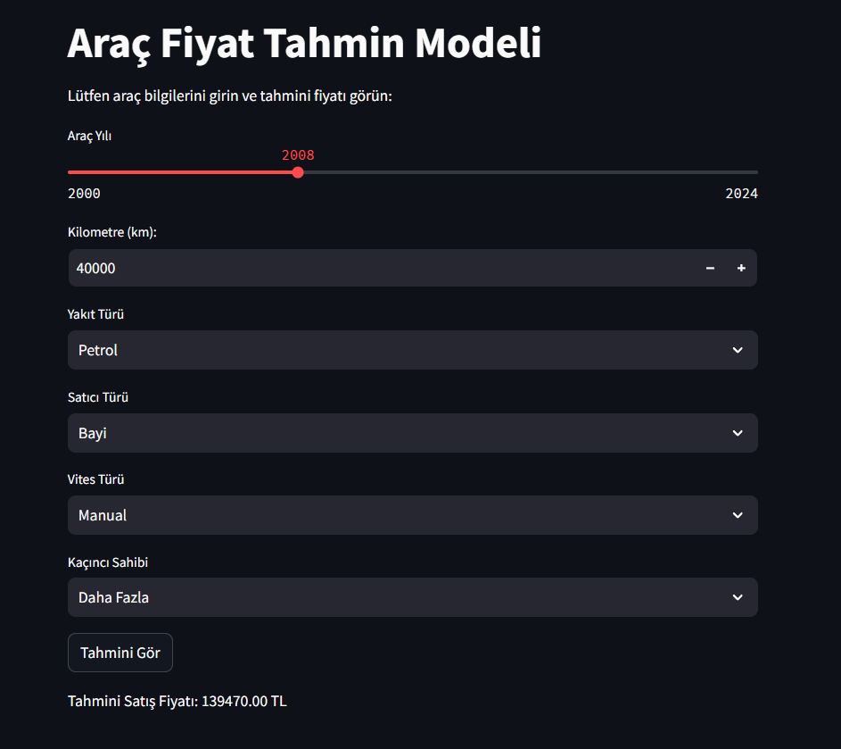
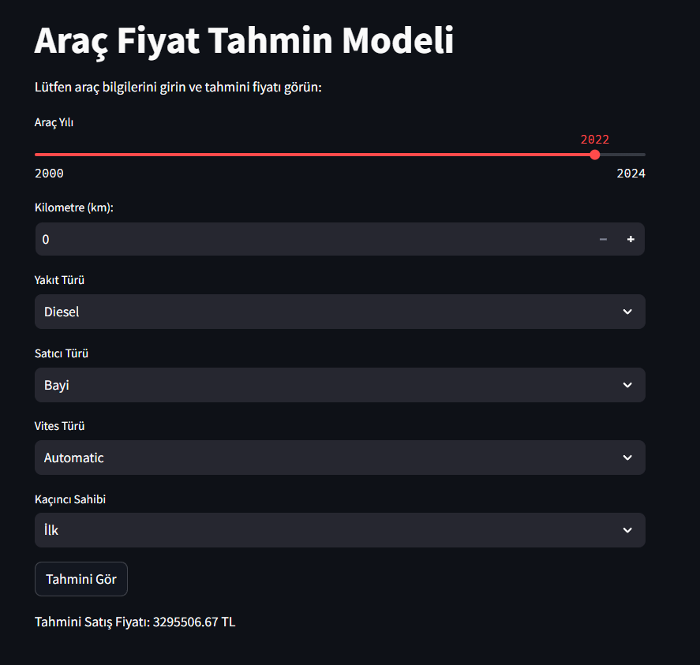

# Araç Fiyat Tahmin Modeli

Bu proje, kullanıcıların araçlarına ait bilgileri girerek tahmini bir fiyat görmelerini sağlayan basit ve etkili bir makine öğrenimi uygulamasıdır. Araç satış fiyatlarını tahmin etmek için geliştirilmiş bu model, **Random Forest Regressor** algoritması ve Python kütüphaneleri kullanılarak inşa edilmiştir. Sonuçlar, kullanıcı dostu bir arayüz üzerinden Streamlit ya da Jupyter Notebook gibi farklı platformlarda sunulmaktadır.

---

## Projenin Amacı

Projenin temel amacı, kullanıcılara hızlı ve basit bir tahmin otomasyonu sunmaktır. Kullanıcılar, araçlarının bilgilerini girerek tahmini satış fiyatını öğrenebilir ve buna göre kararlar alabilir. Proje, uzun araştırmalar gerektiren araç değerleme süreçlerini daha kolay ve hızlı hale getirmek için tasarlanmıştır.

---

## Kullanılan Dataset

Bu proje için kullanılan veri seti, **Kaggle** platformunda bulunan [Vehicle Dataset from CarDekho](https://www.kaggle.com/datasets/nehalbirla/vehicle-dataset-from-cardekho) adlı veri setidir. Bu veri seti, Hindistan ikinci el araç piyasasına ait verilere dayanmaktadır.

---

## Kullanılan Teknolojiler ve Önemi

1. **Python Programlama Dili**:

   - Veri işleme, model oluşturma ve kullanıcı arayüzü tasarımı için kullanıldı.
   - Geniş kütüphane desteği sayesinde hızlı geliştirme imkanı sundu.

2. **Makine Öğrenimi - Random Forest Regressor**:

   - Araç fiyatlarını tahmin etmek için kullanıldı.
   - Hiperparametre optimizasyonu (Grid Search) ile performans artırıldı.
   - Robust ve anlaşılır bir model olması tercih sebebi oldu.

3. **Streamlit**:

   - Kullanıcıların modelle etkileşim kurmasını sağlamak için kullanıldı.
   - Basit ve hızlı bir arayüz geliştirme aracı.

4. **Panel** (Jupyter Notebook'ta Kullanılan Araç):
   - Alternatif bir arayüz geliştirme aracı olarak kullanıldı.
   - Özellikle Jupyter Notebook üzerinde interaktif bileşenler oluşturmak için tercih edildi.

---

## Projede Yapılan Çalışmalar

1. **Veri İşleme ve Hazırlık**:

   - Kategorik sütunlar (`fuel`, `transmission`, `seller_type`, `owner`) sayısal değerlere dönüştürüldü.
   - "Sahiplik" bilgisi (`owner`) dört ayrı sütuna ayrıldı:
     - İlk Sahip, İkinci Sahip, Üçüncü Sahip, Daha Fazla Sahip.
   - Hedef değişken olarak `selling_price` seçildi ve özellikler (X) oluşturuldu.

2. **Makine Öğrenimi Modeli Eğitimi**:

   - Veriler eğitim ve test setine bölündü.
   - Hiperparametre optimizasyonu (Grid Search) ile en iyi Random Forest modeli oluşturuldu.
   - Model, doğruluk ve genel performansı artırmak için optimize edildi.

3. **Kullanıcı Arayüzü**:
   - **Streamlit Kullanımı**:
     - Basit ve anlaşılır bir arayüz ile kullanıcıların tahmin sonuçlarını görmesi sağlandı.
     - Kullanıcılar aracın yılı, kilometresi, yakıt türü, vites türü ve sahiplik sırasını seçerek tahmini fiyatı görebildi.
   - **Panel Kullanımı**:
     - Daha fazla görsel özelleştirme ve esneklik için alternatif bir arayüz Jupyter Notebook'ta oluşturuldu.
     - `brand` (marka) bilgisi de eklendi. Ancak Streamlit tarafında bu kısım teknik zorluklar nedeniyle çıkarıldı.

---

## Projenin Kullanım Alanları

- **Araç Alım-Satım Piyasası**: Kullanıcılar araç alım-satım işlemleri öncesinde tahmini fiyat bilgisi edinebilir.
- **Hızlı Değerleme**: İkinci el araç piyasasında zaman kaybını önleyerek hızlı tahmin yapılabilir.

---

## Projenin Çalıştırılması

1. **Gerekli Kütüphaneleri Yükleme**:

   - `pandas`, `scikit-learn`, `streamlit` ve `panel` kütüphanelerini yükleyin:
     ```bash
     pip install pandas scikit-learn streamlit panel
     ```

2. **Streamlit Uygulamasını Çalıştırma**:

   - Proje dosyasını (örneğin: `home.py`) çalıştırmak için şu komutu kullanabilirsiniz:
     ```bash
     streamlit run home.py
     ```

3. **Jupyter Notebook Arayüzü**:
   - Panel tabanlı uygulamayı çalıştırmak için Jupyter Notebook üzerinden kodu çalıştırın.
   - Arayüz otomatik olarak yüklenir ve kullanıcı tahminleri görebilir.

---

## Örnek Arayüz Görselleri

1. **Streamlit Arayüzü**:

- Streamlit ile oluşturulan local'in nasıl göründüğüne dair ön gösterimi burada görebilirsiniz.
  
  

---

Bu projede, araçların tahmini fiyatlarını bulmak için basit, kullanıcı dostu ve hızlı bir uygulama geliştirilmiştir. Marka bilgisi gibi ek özellikler ilerleyen çalışmalarda arayüzlere dahil edilebilir.
